<h1 align="center">ROS2-Nav2-with-SLAM-and-Navigation</h1>

Ros2 Navigation 2 Stack

# Why Nav2?
Navigation2, or Nav2 for short, is the second generation of the ROS Navigation stack, designed specifically for ROS2. It offers a comprehensive solution for autonomous navigation in robotics and it is particularly useful and important for a number of reasons:

- Improved Performance: Nav2 takes full advantage of the features of ROS2. It's designed with a focus on multi-robot systems, safety, and mission critical reliability, utilizing the real-time and high-performance aspects of ROS2.

- Modularity: Nav2 has a modular design, enabling users to replace or augment different parts of the system to cater to their specific use-cases. For example, you could replace the path planner, controller, or the recovery behaviors with your own implementations.

- Behavior Trees: Nav2 uses behavior trees for task planning, which offer more flexibility and sophistication compared to the state machine model used in the original ROS Navigation stack. This allows more complex behaviors to be encapsulated in a maintainable and reusable way.

- Advanced Features: Nav2 introduces several advanced navigation features not available in the original ROS Navigation stack. For example, it supports dynamic obstacle avoidance, multi-map support, multi-robot support, and 3D perception.

- Safety: Safety and reliability are key priorities in Nav2. It supports safety plugins and various fallback behaviors to ensure safe operation in challenging environments.

- Active Community Support: Nav2 is actively maintained and used by a large community, ensuring regular updates, bug fixes, and improvements.

These attributes make Nav2 an essential tool for building advanced robotic systems using ROS2.

# Setup and Installation
**Version**
- ROS2 Foxy/Ubuntu 20.04

**Install the Nav2 package:**
```bash
$ source /opt/ros/foxy/setup.bash
$ sudo apt update
$ sudo apt install ros-foxy-navigation2 ros-foxy-nav2-bringup
```

**Install the ROS2 Turtlebot3**
```bash
$ source /opt/ros/foxy/setup.bash

**[Option1]**
```bash
$ sudo apt install ros-foxy-turtlebot3*
```
**[Option2]**

# Create a new ROS2 workspace:
```bash
$ mkdir -p ~/turtlebot3_ws/src
$ cd ~/turtlebot3_ws
```
#Clone the TurtleBot3 packages:
```bash
$ cd ~/turtlebot3_ws/src/
$ git clone -b foxy-devel https://github.com/ROBOTIS-GIT/turtlebot3.git
$ git clone -b foxy-devel https://github.com/ROBOTIS-GIT/turtlebot3_msgs.git
$ git clone -b foxy-devel https://github.com/ROBOTIS-GIT/turtlebot3_simulations.git
```
# Install Dependencies:
```bash
$ sudo apt install python3-colcon-common-extensions
$ sudo apt install terminator
```

# Generate a Map with SLAM
The goal for navigation is to make a robot move from one place to another while avoiding collision. 

**Navigation: a 2 step process**:
* **Step1:** Create a map (with SLAM) - Fist create a map of the world(the space where the robot can move).
* **Step2:** Make the robot navigate from point A to point B

**SLAM**: Allows the robot to localize itself in the environment relative to all of the worlds, the objects, obstacles and at the same time, it will also map this environemnt.

**Cehck Sections Below:**
* [grid based fast SLAM](https://github.com/bmaxdk/grid-based-fastSLAM)
* [graph SLAM](https://github.com/bmaxdk/graphSLAM)
* [SLAM RTAB Map](https://github.com/bmaxdk/RoboticsND-RTAB-Map-My-World)

# Turtlebot3 Environment Launch
```bash
$ source /opt/ros/foxy/setup.bash

# set turtlebot3 robot
$ export TURTLEBOT3_MODEL=waffle   
```
You can simply save this setup at `bashrc` 
```bash
$ vim ~/.bashrc
$ source .bashrc
$ printenv | grep TURTLE
```
**Control turtlebot3**
```bash
$ ros2 launch turtlebot3_gazebo turtlebot3_world.launch.py

# Run telop key
$ ros2 run turtlebot3_teleop teleop_keyboard
```

# Generate and Save a Map with SLAM in ROS2
```bash
$ ros2 launch turtlebot3_gazebo turtlebot3_world.launch.py

# Launch SLAM feature for turtlebot3 and set simulation time
$ ros2 launch turtlebot3_cartographer cartographer.launch.py use_sim_time:=True
# This launch file contains SLAM feature

# Run telop key
$ ros2 run turtlebot3_teleop teleop_keyboard
```
### Move around to create map
```bash
# Save map into map folder
$ mkdir map

# Save map
$ ros2 run nav2_map_server map_saver_cli -f maps/my_map
```

```yaml
image: maps/my_map.pgm # path of the image
mode: trinary
resolution: 0.05 # meters per pixel in .pgm image
origin: [-1.26, -2.41, 0] # origin of the map
negate: 0
occupied_thresh: 0.65 # probabily that one pixel is occupied or not 65% or above than it is occpuied [0 255]
free_thresh: 0.25 # less than 25% then we consider the pixel[0 255] as not occupied
```

**To get acctual dimension of the map:**

`$ vi my_map.pgm`
```pgm
P5
125 118
255
```
* 125 * 0.05 resolution
* 118 * 0.05 resolution 


# Make a Robot Navigate
Use navigation stack to generate

### For ROS2: Fix Nav2
**Need to Correct DDS. This will allow us to make the navigation to stack work correctly**
First: We are going to change the DDS from **fast DDS** to **cyclone DDS** to make it quick.

ROS2 communication is based on DDS.

To install cyclone DDS:
```bash
$ sudo apt update
# $ sudo apt install ros-humble-rmw-cyclonedds-cpp # For ROS2 Humble
$ sudo apt install ros-foxy-rmw-cyclonedds-cpp # For ROS2 Foxy

# Tell ROS2 to use these DDS
$ export RMW_IMPLEMENTATION=rmw_cyclonedds_cpp
# you may want to add in ~/.bashrc

# You need to edit waffle.yaml
$ cd /opt/ros/foxy/share/turtlebot3_navigation2/param
$ sudo vi waffle.yaml
```
modify line where `robot_model_type: "differential"` to `robot_model_type: "nav2_amcl::DifferentialMotionModel"`

This is issue from TurtleBot3 robot. 


# Make the Robot Navigate Using the Generated Map
```bash
$ ros2 launch turtlebot3_gazebo turtlebot3_world.launch.py

$ ros2 launch turtlebot3_navigation2 navigation2.launch.py use_sim_time:=True map:=maps/my_map.yaml

```

**If map doesn't appeared in RViz**
Correct `yaml` file.
```yaml
image: map/my_map.pgm
mode: trinary
resolution: 0.05
origin: [-1.26, -2.41, 0]
negate: 0
occupied_thresh: 0.65
free_thresh: 0.25
```

change `yaml` file above to bottom

```yaml
image: my_map.pgm
mode: trinary
resolution: 0.05
origin: [-1.26, -2.41, 0]
negate: 0
occupied_thresh: 0.65
free_thresh: 0.25
```


From the image above, you want to give an estimation of where the robot is in the map. Click `2D Pose Estimate` in `RViz` the tell where the robot is. 


Now this image above is assigned where the robot is at this moment in this map. The small rectangle is going to try to match the environment. So when the robot move, the robot can localize itself in the map. If you put a wrong robot pose estimate with wrong orientation, **laser scan data** from `Gazbo` the reality does not correspond to the `map`.

Now you can try with either `teleop key` or `Navigation2 Goal` to move.


The real robot is reaching the destination (Goal).


# Waypoint Follower - Go Through Multiple Nav2 Goals
You can set several waypoint in one time to navigate the goal.


In `RViz`, as shown above, you can click **Waypoint mode** then click `Navigation2 Goal` to set several waypoints and then click `Start Navigation` button or you can click `Start Nav Through Poses` (for without stopping).


# Dynamic Obstacles Avoidance
There is a feature that the navigation to stack is the way to avoid obstacles dynamically. Currently static objects such as wall is already included in the map which the navigation already knows about them.

What will happen if suddenly you have a new object randomly in the map?

If someone is walking in front of the robot, the navigation stack should be able to avoid this.

In simulation `Gazbo`, go to `Insert` and you can add objetcs in the world.

The navigation recalculate to avoid the obstacles.

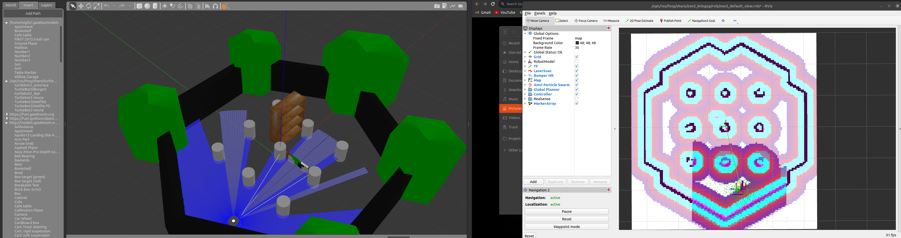
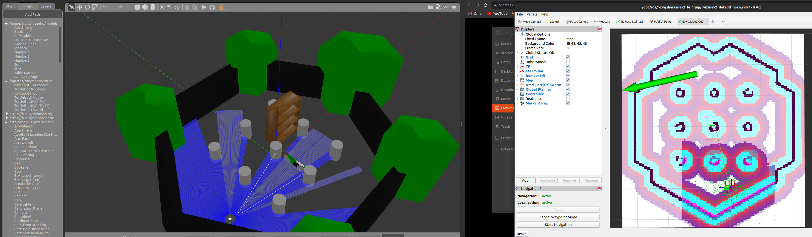
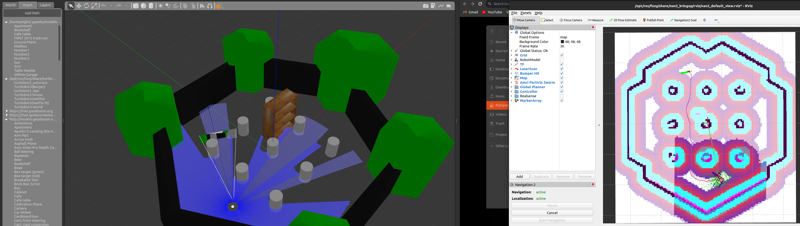
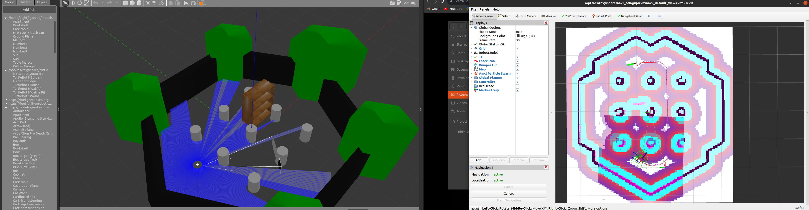
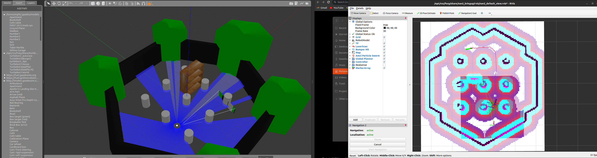
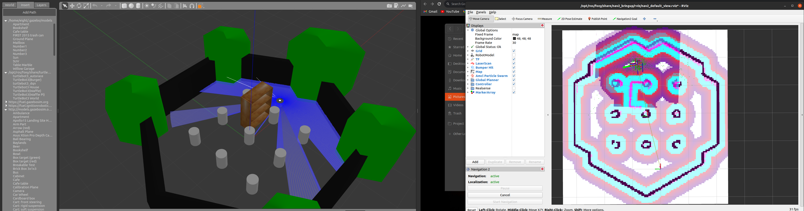

# Navigation Activity - Navigation with TurtleBot3_house

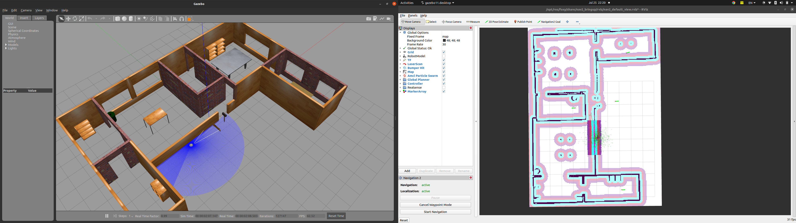
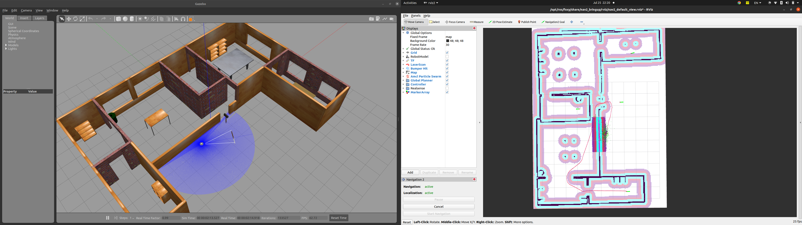
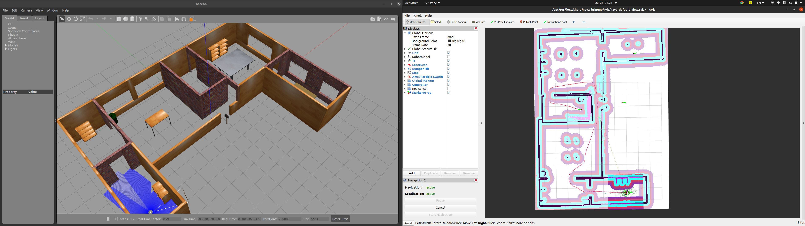
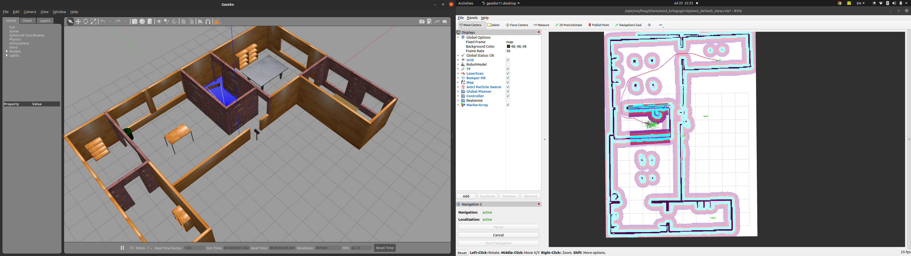

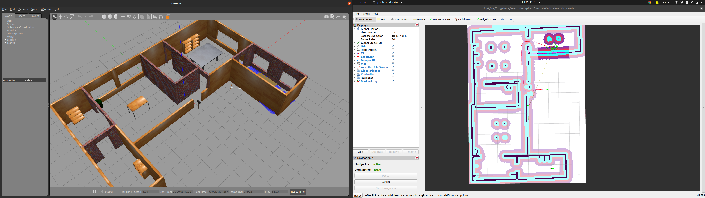
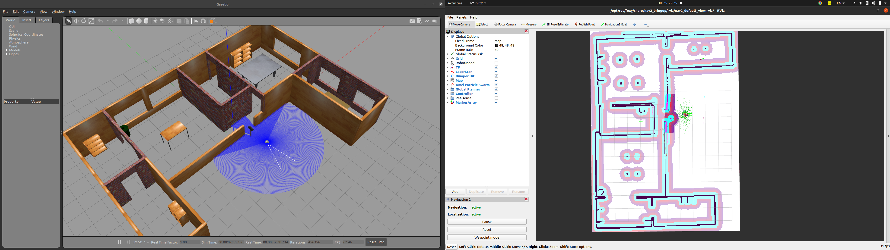

# Global Planner, Local Planner and Costmaps
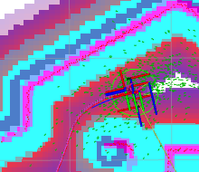

In the picture, the pink line will be the **global plan** and the blue line is the **local plan**.

In the `Rviz Displays Pannel`, **local planner** called here is `Controller`. When you sending `Nav2 Goal` The **global planner** will compute the path that you see in pink. The **global planner** will use the entire map to compute the path, so it will try to reach the destination as fast as possible with the best possible path. And to compute this, it will use **cost map** under `Global planner`. **Cost map** is where each pixel has a cost. So if a pixele obstacle or a wall is going to have the highest possible cost, then we have some sor of margin with blue so that we make sure that this is kind of also an obstacle.

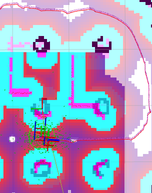

As you see this blue boundary avoid robot to bump into the obstacle. This blue rigion is safety margin. 

Basically this cost map has been generated so that the red pixel, we have a higher cost than bluish pixel.

**Local planner**, Contorller is for control the robot to follow the path and update of the update rate for this controller is going to be higher.

**Local planner** is where robot is actually follows.

* When you give a navigation goal, the **global planner** will compute a path using the **global cost map**. It will then transfer this path to the **local planner or the controller**, which will be responsible for actually making the robot move and try to follow the global path in a **local environment**.
# Modify Navigation Parameters
There are lots of parameters for the stack. One of the useful parameter will allow you to tune the cost maps. To find the parameter.

```bash
# Terminal1
$ ros2 launch turtlebot3_gazebo turtlebot3_world.launch.py 

# Ternimal2
$ ros2 launch turtlebot3_navigation2 navigation2.launch.py use_sim_time:=True map:=maps/my_map.yaml 

# In RViz, Setup 2D Pose Estimate

# Terminal3
$ rqt
```
In rqt, `Plugins` << `Configuration` << `Dynamic Reconfigure`.

Let's se **global_costmap** and select **global_costmap** as shown below.

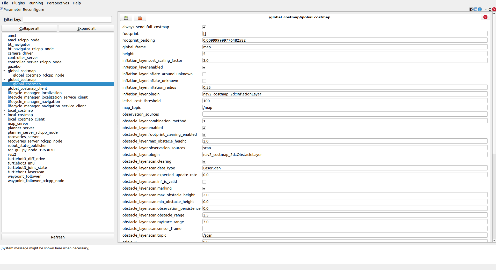

Now you can see all of the parameters and this shows the live parameters for the global cost map. There's lots of parameters are indicated.

Let's pay attention `publish_frequency`. It is currently set to 1Hz which update frequency is one hertz. So the cost map is going to be updated at on hertz.

Let's also check `inflation_layer.inflation_radius` which set to 0.55

Now let's set this 0.55 to 0.25, blue region in RViz, it shrink. So the robot will be able to go closer to the obstacles. Normally depends on the robot boundary radius, use the robot's radius.


# Recovery Behavior
In the real world, and even in the simulation with Gazebo, you've seen that sometimes the robot just doesn't manage to reach the destination.

Maybe the destination point is not valid or there is a new obstacle in the way that cannot be avoided or the path is too narrow or simply the algorithm just fails to properly follow the path. In those cases, the navigation stack will start what is called a **recovery behavior**.

**Recovery behavior** is simply a behavior that's predefined for the robot, and that will try to fix the current issue so that the robot can continue to move and reach the destination goal.

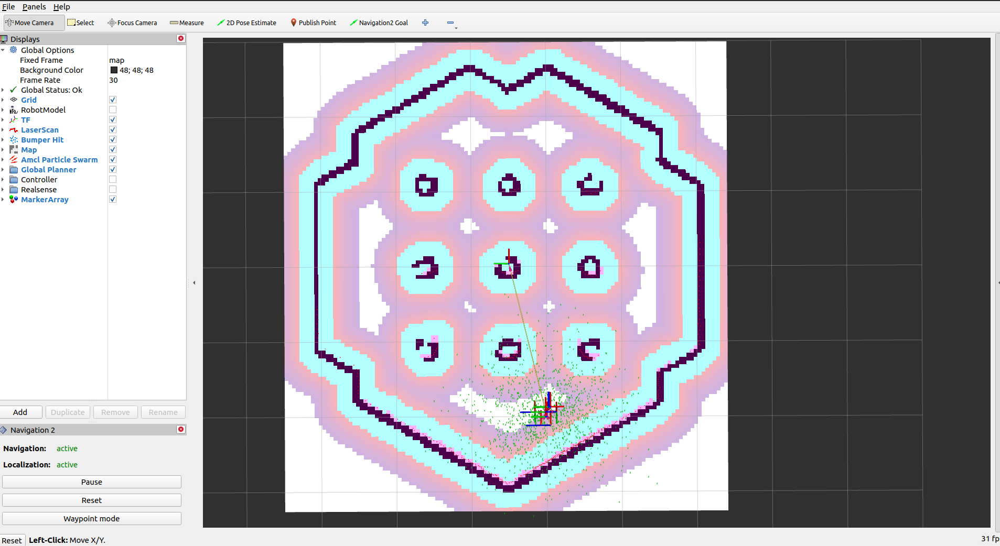

If the goal is valid and if the path is free of obstacles, then the **global planner** will compute the path the local planner will try to follow and success. What if Nav2 Goal is pointed outside of the wall? Since robot doesn't manage to reach, the robot is going backward and then the robot is keep turning.

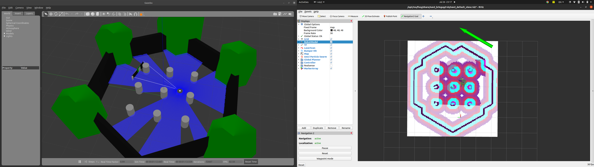
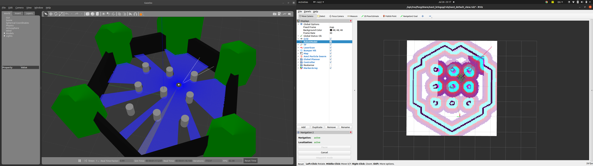
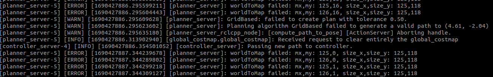

As shown error above, `planner server` which is **global planner** is showing `Abording handle` and `bt_navigato` shows that the `Goal failed`. So what's happening is that the **global planner** in `planner server` node is going to try to compute a path and it's going to try to send this path to the **local planner** but there is an issue. If the **global planner** can't successsfully generate a path or if the **local planner** can't successfully follow the path, then the `recovery server` will be called and will start a `recovery behavior`. So **Recovery behavior** can be just go back a bit or turn around a bit which will try to find path and `behavior server` will be called to try to clear the map.
# TFs and Important Frames
Transforms called `tf`. Let's see the relationship between TFs and navigation.

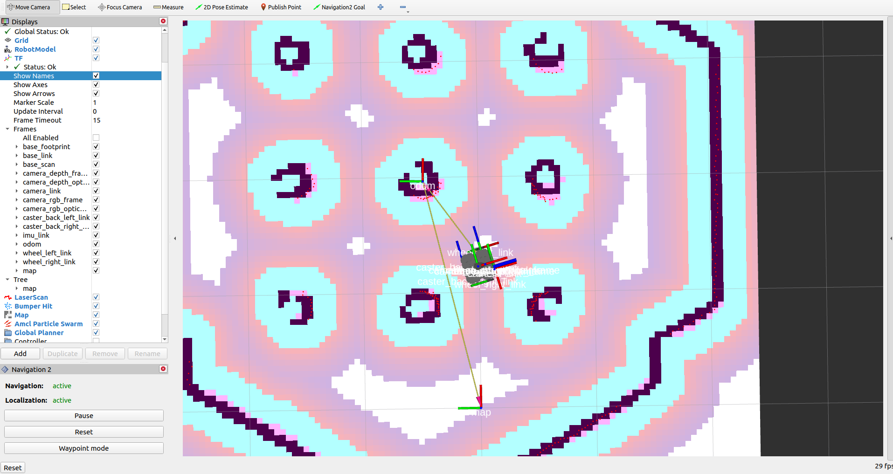

* We need to **keep track of each frame** relative to other frames. 
* Using ROS2 tf2 package.
* Keeps track of each 3D coordinate frame over time.
* Structured tree containing all the frames.
* It can easily subscribe to the TF topic.
* To get TFs for robot, subscribe to the /tf topic, or visualize them in RViz

```bash
$ ros2 run tf2_tools view_frames
```
This will listen to the TF for 5 seconds and after 5 seconds, it's going to export a PDF. In the PDF you can see there is the tree of all of the transformers in the robot and with the world.

**Required TFs for Nav2**:
1. map -> odom
2. odom -> base_link
3. base_link -> base_scan

Usually the **base_link** is the first frame of your robot, but this frame may not be on the ground.

In here the **base_link** to **base_scan**, which is where the Lidar is, where laser scan is. The **transformation** between **base_link** and the **base_scan** is usually fixed because LIDAR doesn't move relative to the main structure of the robot.

Let's see the difference between TFs and the navigation stack. Let's talk about 3 frames:
* base_footprint(or base_link)
* map
* odom

The **map** frame and the relationship between **map** and footprint will be used to compute the exact location of the robot with SLAM using the laser scan from the LiDAR or it could be a GPS.

**Odom** is short for odometry. It's basically an estimation of the robot position using the robot's internal measurements. For example, the recorded speed of the wheels. The location is going to be quite smooth in the short term, but it's going to drift over time.

So the navigation stack does is it will take the best of both and combine **map** and **odom** so we can have a precise location of the robot over time, but as well as location that is linear is smooth which means it's not going to jump around all the time.

Now the only thing is that due to the design of TF in ROS, one grame can only have one parent, one frame can have one parent and many childeren, but only one parent.

So the `base_footprint` or the `base_link` cannot have two parents. So that's why it has been decided that the map frame will become the parent of the odom frame. And the odom frame, the parent of the base_link are based_footprint. Simply the map frame will be used to keep a precise location in the long term and the odom will be used to keep a smooth location in the short term.
# The Nav2 Architecture - Explained Step by Step

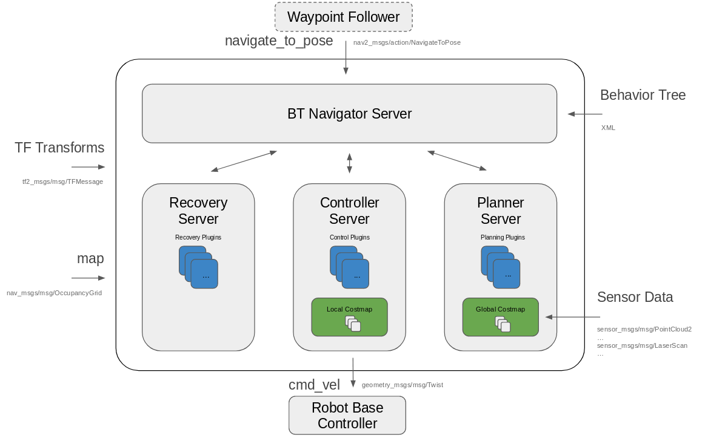

The most outer box here is navigation2. In order to function, the navigation stack requires some inputs you have first the transforms are `TF`. Before we made the robot navigate, we first used SLAM to generate a `map` and then we give the map to the navigation stack and on top of TF and the map navigation also requires to receive `sensor data` such as a laser scan from a LIDAR. It can also a combination of many things (camera stream, 3D scanner, etc).

Now you see all the inputs for the stack. What is happening when you send a navigation goal? The goal here will be a **pose which means a position plus an orientation for the robot**. First, **the global planner** also called the **planner server**, will be responsible for finding a **valid path using the map**. Also, using the **global cost map** once a path has been found, the **local planner** also called **controller** will try to make sure that the robot follows the path and reaches the destination. The **local planner** will use the **local cost map**, but also the data from the different sensors. And then the **local planner** will send a comment to the robot **controller** itself. The robot **controller** is a custom **controller** for the robot responsible to take a velocitty command, for example, translate it into a command that can be sent to the models so that the robot can move. This **controller** is independent from the navigation stack and then to complete this architecture. One thing that may happen is that the robot cannot correctly follow the path for various reasons. In this case, a **recovery behavior** will be intended. For example, it can try to clear the cost map or move a bit back turn, etc..


**BT Navigator Server** where BT means **behavior tree** is indicated more details in [here](https://navigation.ros.org/behavior_trees/overview/nav2_specific_nodes.html).