<h1 align="center">ROS2-Nav2-with-SLAM-and-Navigation</h1>

Ros2 Navigation 2 Stack

# Why Nav2?
Navigation2, or Nav2 for short, is the second generation of the ROS Navigation stack, designed specifically for ROS2. It offers a comprehensive solution for autonomous navigation in robotics and it is particularly useful and important for a number of reasons:

- Improved Performance: Nav2 takes full advantage of the features of ROS2. It's designed with a focus on multi-robot systems, safety, and mission critical reliability, utilizing the real-time and high-performance aspects of ROS2.

- Modularity: Nav2 has a modular design, enabling users to replace or augment different parts of the system to cater to their specific use-cases. For example, you could replace the path planner, controller, or the recovery behaviors with your own implementations.

- Behavior Trees: Nav2 uses behavior trees for task planning, which offer more flexibility and sophistication compared to the state machine model used in the original ROS Navigation stack. This allows more complex behaviors to be encapsulated in a maintainable and reusable way.

- Advanced Features: Nav2 introduces several advanced navigation features not available in the original ROS Navigation stack. For example, it supports dynamic obstacle avoidance, multi-map support, multi-robot support, and 3D perception.

- Safety: Safety and reliability are key priorities in Nav2. It supports safety plugins and various fallback behaviors to ensure safe operation in challenging environments.

- Active Community Support: Nav2 is actively maintained and used by a large community, ensuring regular updates, bug fixes, and improvements.

These attributes make Nav2 an essential tool for building advanced robotic systems using ROS2.

# Setup and Installation
**Version**
- ROS2 Foxy/Ubuntu 20.04

**Install the Nav2 package:**
```bash
$ source /opt/ros/foxy/setup.bash
$ sudo apt update
$ sudo apt install ros-foxy-navigation2 ros-foxy-nav2-bringup
```

**Install the ROS2 Turtlebot3**
```bash
$ source /opt/ros/foxy/setup.bash

**[Option1]**
```bash
$ sudo apt install ros-foxy-turtlebot3*
```
**[Option2]**

# Create a new ROS2 workspace:
```bash
$ mkdir -p ~/turtlebot3_ws/src
$ cd ~/turtlebot3_ws
```
#Clone the TurtleBot3 packages:
```bash
$ cd ~/turtlebot3_ws/src/
$ git clone -b foxy-devel https://github.com/ROBOTIS-GIT/turtlebot3.git
$ git clone -b foxy-devel https://github.com/ROBOTIS-GIT/turtlebot3_msgs.git
$ git clone -b foxy-devel https://github.com/ROBOTIS-GIT/turtlebot3_simulations.git
```
# Install Dependencies:
```bash
$ sudo apt install python3-colcon-common-extensions
$ sudo apt install terminator
```

# Generate a Map with SLAM
The goal for navigation is to make a robot move from one place to another while avoiding collision. 

**Navigation: a 2 step process**:
* **Step1:** Create a map (with SLAM) - Fist create a map of the world(the space where the robot can move).
* **Step2:** Make the robot navigate from point A to point B

**SLAM**: Allows the robot to localize itself in the environment relative to all of the worlds, the objects, obstacles and at the same time, it will also map this environemnt.

**Cehck Sections Below:**
* [grid based fast SLAM](https://github.com/bmaxdk/grid-based-fastSLAM)
* [graph SLAM](https://github.com/bmaxdk/graphSLAM)
* [SLAM RTAB Map](https://github.com/bmaxdk/RoboticsND-RTAB-Map-My-World)

# Turtlebot3 Environment Launch
```bash
$ source /opt/ros/foxy/setup.bash

# set turtlebot3 robot
$ export TURTLEBOT3_MODEL=waffle   
```
You can simply save this setup at `bashrc` 
```bash
$ vim ~/.bashrc
$ source .bashrc
$ printenv | grep TURTLE
```
**Control turtlebot3**
```bash
$ ros2 launch turtlebot3_gazebo turtlebot3_world.launch.py

# Run telop key
$ ros2 run turtlebot3_teleop teleop_keyboard
```

# Generate and Save a Map with SLAM in ROS2
```bash
$ ros2 launch turtlebot3_gazebo turtlebot3_world.launch.py

# Launch SLAM feature for turtlebot3 and set simulation time
$ ros2 launch turtlebot3_cartographer cartographer.launch.py use_sim_time:=True
# This launch file contains SLAM feature

# Run telop key
$ ros2 run turtlebot3_teleop teleop_keyboard
```
### Move around to create map
```bash
# Save map into map folder
$ mkdir map

# Save map
$ ros2 run nav2_map_server map_saver_cli -f maps/my_map
```

```yaml
image: maps/my_map.pgm # path of the image
mode: trinary
resolution: 0.05 # meters per pixel in .pgm image
origin: [-1.26, -2.41, 0] # origin of the map
negate: 0
occupied_thresh: 0.65 # probabily that one pixel is occupied or not 65% or above than it is occpuied [0 255]
free_thresh: 0.25 # less than 25% then we consider the pixel[0 255] as not occupied
```

**To get acctual dimension of the map:**

`$ vi my_map.pgm`
```pgm
P5
125 118
255
```
* 125 * 0.05 resolution
* 118 * 0.05 resolution 


# Make a Robot Navigate
Use navigation stack to generate

### For ROS2: Fix Nav2
**Need to Correct DDS. This will allow us to make the navigation to stack work correctly**
First: We are going to change the DDS from **fast DDS** to **cyclone DDS** to make it quick.

ROS2 communication is based on DDS.

To install cyclone DDS:
```bash
$ sudo apt update
# $ sudo apt install ros-humble-rmw-cyclonedds-cpp # For ROS2 Humble
$ sudo apt install ros-foxy-rmw-cyclonedds-cpp # For ROS2 Foxy

# Tell ROS2 to use these DDS
$ export RMW_IMPLEMENTATION=rmw_cyclonedds_cpp
# you may want to add in ~/.bashrc

# You need to edit waffle.yaml
$ cd /opt/ros/foxy/share/turtlebot3_navigation2/param
$ sudo vi waffle.yaml
```
modify line where `robot_model_type: "differential"` to `robot_model_type: "nav2_amcl::DifferentialMotionModel"`

This is issue from TurtleBot3 robot. 


# Make the Robot Navigate Using the Generated Map
```bash
$ ros2 launch turtlebot3_gazebo turtlebot3_world.launch.py

$ ros2 launch turtlebot3_navigation2 navigation2.launch.py use_sim_time:=True map:=maps/my_map.yaml

```

**If map doesn't appeared in RViz**
Correct `yaml` file.
```yaml
image: map/my_map.pgm
mode: trinary
resolution: 0.05
origin: [-1.26, -2.41, 0]
negate: 0
occupied_thresh: 0.65
free_thresh: 0.25
```

change `yaml` file above to bottom

```yaml
image: my_map.pgm
mode: trinary
resolution: 0.05
origin: [-1.26, -2.41, 0]
negate: 0
occupied_thresh: 0.65
free_thresh: 0.25
```

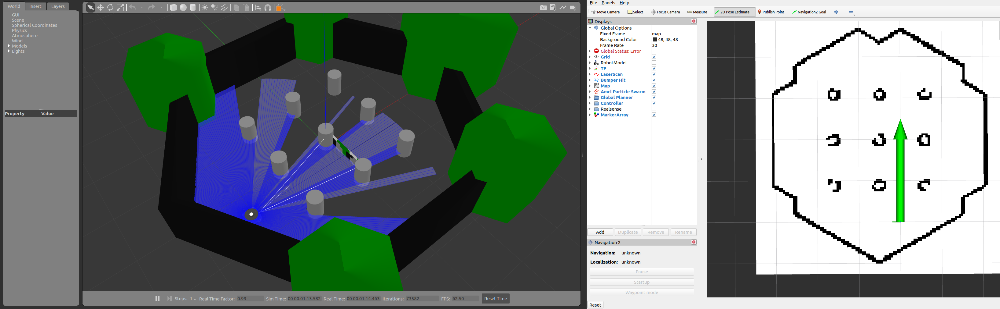

From the image above, you want to give an estimation of where the robot is in the map. Click `2D Pose Estimate` in `RViz` the tell where the robot is. 

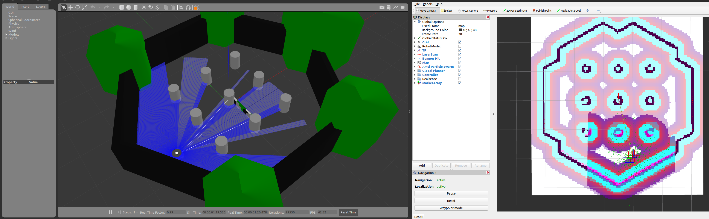

Now this image above is assigned where the robot is at this moment in this map. The small rectangle is going to try to match the environment. So when the robot move, the robot can localize itself in the map. If you put a wrong robot pose estimate with wrong orientation, **laser scan data** from `Gazbo` the reality does not correspond to the `map`.

Now you can try with either `teleop key` or `Navigation2 Goal` to move.

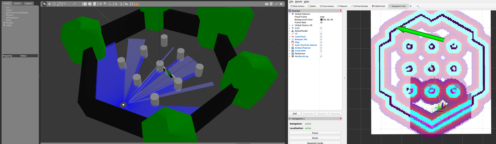
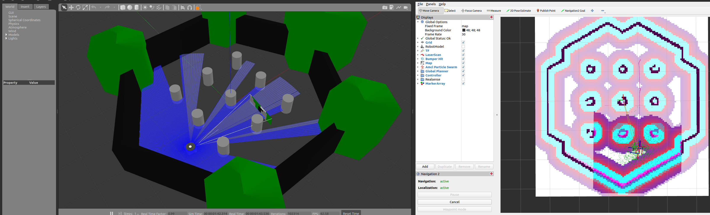
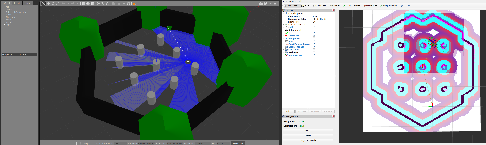

The real robot is reaching the destination (Goal).


# Waypoint Follower - Go Through Multiple Nav2 Goals
You can set several waypoint in one time to navigate the goal.

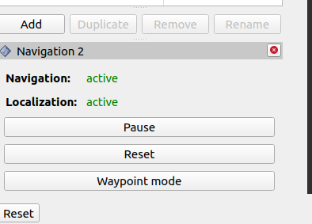

In `RViz`, as shown above, you can click **Waypoint mode** then click `Navigation2 Goal` to set several waypoints and then click `Start Navigation` button or you can click `Start Nav Through Poses` (for without stopping).

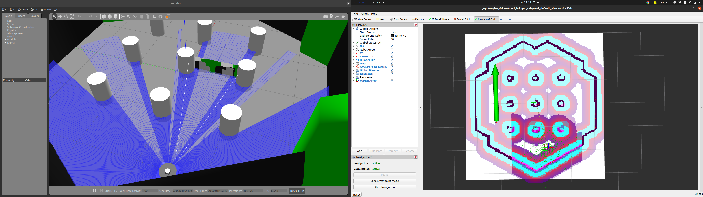
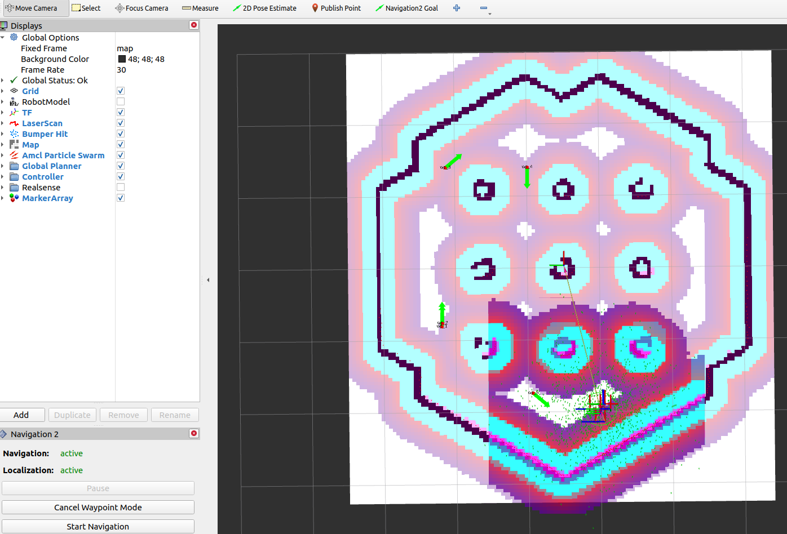
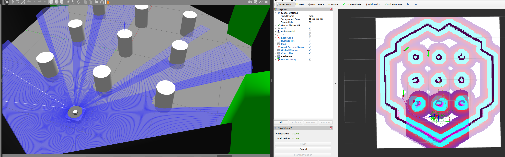
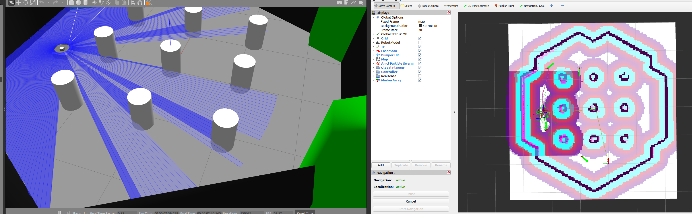
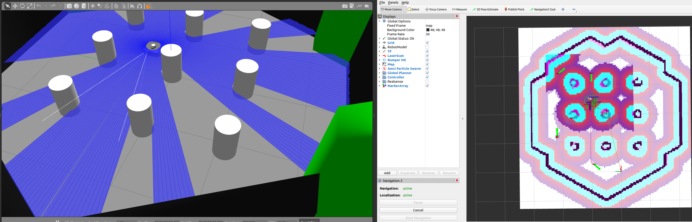

# Dynamic Obstacles Avoidance
There is a feature that the navigation to stack is the way to avoid obstacles dynamically. Currently static objects such as wall is already included in the map which the navigation already knows about them.

What will happen if suddenly you have a new object randomly in the map?

If someone is walking in front of the robot, the navigation stack should be able to avoid this.

In simulation `Gazbo`, go to `Insert` and you can add objetcs in the world.

