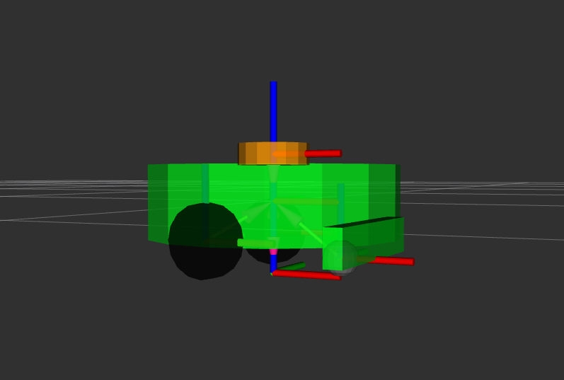
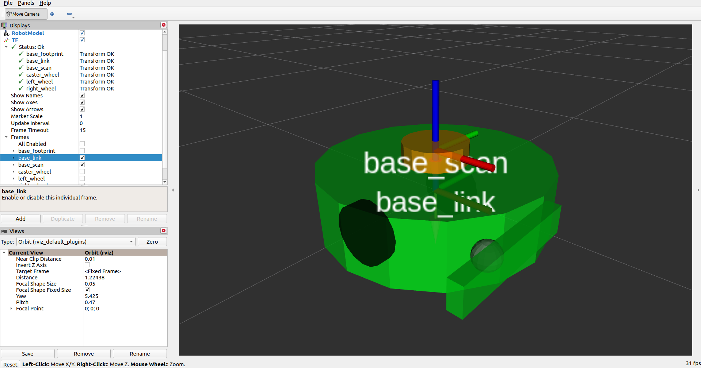
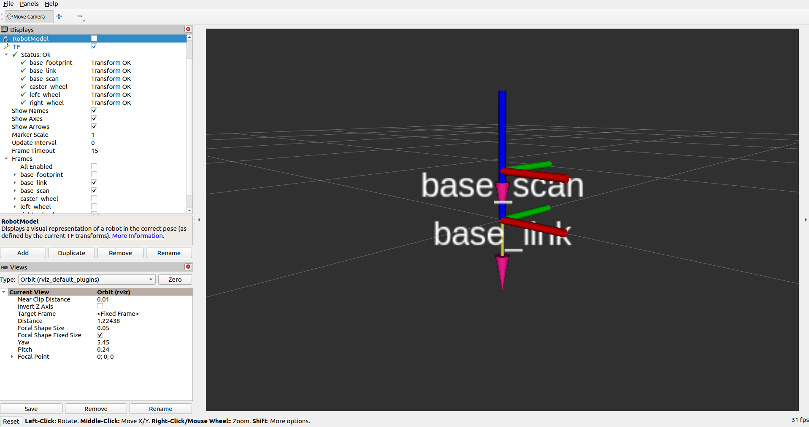
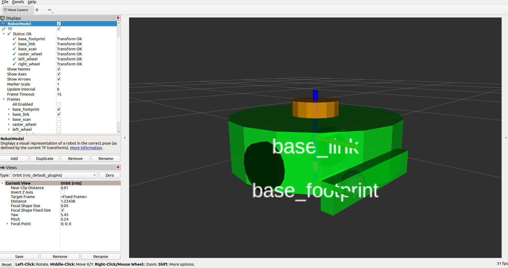
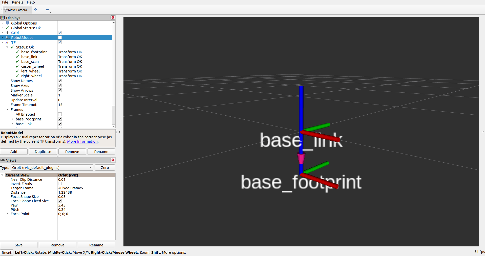
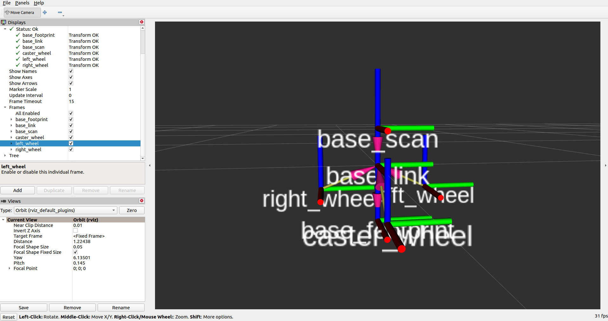
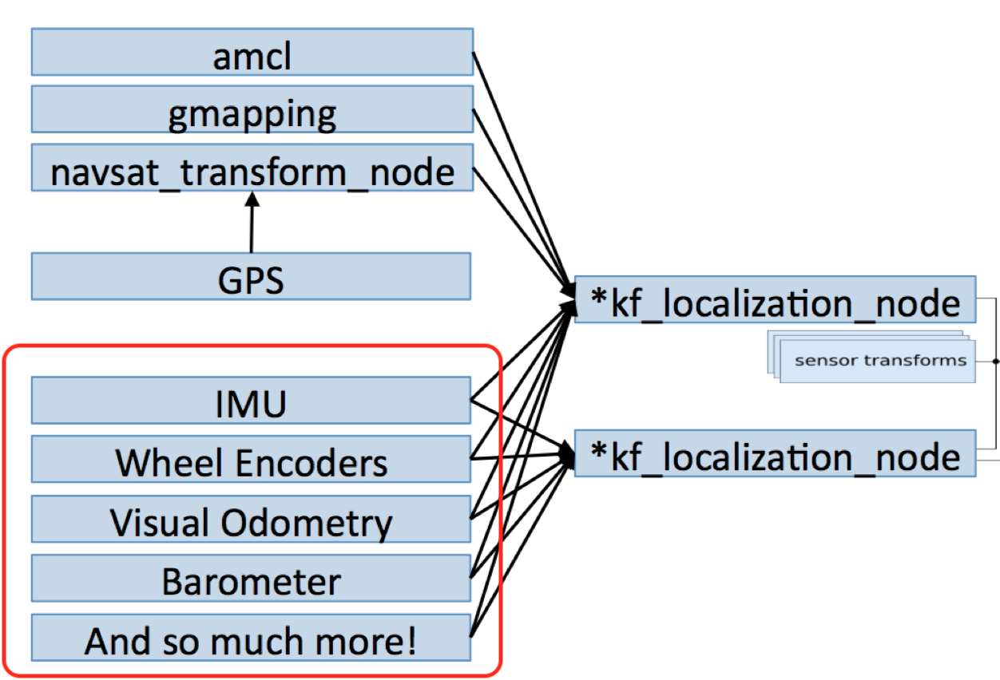

<h1 align="center">Adapting a Custom Robot for Nav2 Project</h1>

Start with `TF transforms` that are required for the navigation to stack. When you launch `rviz` with TurtleBot3, you have seen that we can dispay the `TF transforms` for the robot.


In `TF`, there is different frames, `base_link`, `base_footprint`, `base_scan`, etc..  

In ROS2 we need to keep track of each frame of the robot and the environment relative to all other frame. You could need to know where a robot is relative to another robot or where a laser scan is relative to the map origin or to another part of the robots, etc.

The default solution to find this is to compute a `3D translation` plus `3D rotation` between each existing frame. Using `TF` package allows this process simpler. `TF package` which is named `TF` to the `TF package` will keep track of each 3D coordinate frame over time and it is as true to the tree of all the frames in your robot and in the environemnt.


We need at least three transfoms so the robot can work with `TF2`.

TFs needed for Nav2:
1. `map` -> `odom`

    The first one is the `map` to `odom`. This is going to be published by the localization features.

2. `odom` -> `base_link`
    The second, `odom` to `base_link` 
    (Will talk about it after step 3)

3. `base_link` -> `base_scan`

    Third, `base_link` to `base_scan`

    

    As you can see, the `base_link` frame will be the frame that is attached to the main structure of the chassis of the robot. This `base_link` frame is usually the first frame that you design for any robot that you create in ROS2. Now the `base_scan` frame is where the LiDAR is situated, so basically where the laser scan is coming from and the transform that we're interested in is the transform between those two frames. Basically, we want to know where the laser scan is relative to the origin of the main structure of the robot. Without this, robot won't know where the obstacles detected with the light. In some cases you might see the frames placed just like this here on the image above. So that the `base_link` frame is at the lowest point of the structure. Some may shows `base_link` located in center of the main frame which is ok. The only important thing is to make sure that the frame for the `base_scan` is placed correctly exactly where the LiDAR is. In `rqt`, you will be able to see that the `tf tree` indicates that is connected `base_link` to `base_scan`. Having this `base_link` to `base_scan` in the tree, the navigation can also compute the transformation between the `map` frame and the `base_scan` to effectively use the data from the LiDAR and the place of the obstacles correctly on the `map`.


Any robot that you create, you will create a `URDF (United Robot Description Format)` file to describe all the elements and frame of your robot. URDF is `XML` format. In URDF, you robot will be described the different frames of the robot, including, base_link and base_scan of the frame. 

**To create TFs, we just need to create a URDF**


Once we have written the URDF, we can start an existing node that you will find in almost all robots. This node is the `robot_state_publisher`. As input, it will receive the URDF and the `joint_states` data published by the controller to say, for example, what is the position of the velocity of the wheels. As an output, the `robot_state_publisher` will then compute and publish the transforms for your robot, and this `TF` is going to be used by the navigation stack.

```bash
$ sudo apt install ros-foxy-urdf-tutorial

# source ros2
$ source /opt/ros/foxy/setup.bash
$ ros2 launch urdf_tutorial display.launch.py model:=$(pwd)/my_robot.urdf
```



As shown `my_robot.urdf`, you can see the different frames.

Picture below you can see `base_link` in main structure and `base_scan` that points to `base_link`.




Here below, also shown `base_footprint`, which is the projection of the `base_link` of the floor. So it's going to be on the smae plan, on the same 2D plan as the `odom` and `map`.



The most important parts are the relationship between the `base_link` and `base_scan`.


[my_robot.urdf](https://github.com/bmaxdk/ROS2-Nav2-with-SLAM-and-Navigation/blob/main/project_build_robot/my_robot.urdf) indicates how each link joint each other. Inside the `urdf` file, we have **link** and **link** is going to be one frame. For example, `base_footprint` and `base_link`. **Joint** is the relationship between those two frames. So we have in there, we have a `frame base_link` use `joint` which have `parent` and `child`. The child in `base_joint` is `base_link` and the paren in there is `base_link`.

`link` <-> `joint` <-> `link`

**To see URDF of the TurtleBot3:**
```bash
$ cd /opt/ros/foxy/share/turtlebot3_description/urdf
$ vi turtlebot3_waffle.urdf
```

Now you have seen that you need to create URDF for your robot so that you can publish a `base_link` ot `base_scan` for the navigation stack.

As I mentions in step 2, `odom -> base_link` TF is important. The odometry is used to localize a robot from its starting point, using its own motion. There will be drifiting of a distance all time depending on the data and so on. Therefore, even if the `odometry drifts`, it will be compensated with the map frame by the navigation stack. Therefore, in the end, will have both a precise location. 

`map` -> `odom` -> `base_link` 

### Odometry with Wheel Encoder
A **wheel encoder** will tell you at what velocity wheel will be turning. By doing a simple integration calcualtion, you can also compute the position over the distance.

Here is two options:
* Option1: 
    - Read velocity from encoders and compute position (You can get the velocity and compute the position yourself).
    - Publish `nav_msgs/Odometry` msg (on the `/odom` topic) 
    - Publish the `odom` -> `base_link` TF (on the `/tf` topic)
* Option2 (recommend):
    - ros2_control (**diff_drive_controller**): You could use a frameworks such as ROS2 controller and in the framework, use the `diff_drive_controller`, which already does that for you.
    - ros2_control and ros2_controllers provide the foundation for robot control in ROS2
    - If you're working with ros2_control for a differential drive robot with wheel encoders in the context of the ROS 2 Navigation Stack (nav2), you'd typically be using the diff_drive_controller to interface with your robot's actuators and the joint_state_controller to report the state of the robot (e.g., wheel positions and velocities). The reported state would be used, among other things, to update the robot's pose in the world based on encoder readings.
    - URDF Configuration: Ensure that your robot's URDF (or xacro) description includes the necessary transmission elements for ros2_control

In your robot, you could have several sensors, which means several possible sources for computing a better and more precise `odometry`.



One of the most common sensors that you might have on your robot is an IMU or inertial measurement unit. You would then publish the odometry on the topic either directly with ROS2 controller, and then you will publish the IMU data on the IMU topic. Then you run the localization node, which is going to subscribe to those topics and also merge and filter data. The robot localization will publish the new `odom` on the automated filtered topic and it will also publish the `odom` to `base_link` transform for you.

### Setup Sensors
Wheel encoders and LIDAR is good enough. More sensors might improve the navigation precision, but those two just are enough to start.

In Sensor **Camera**, as shown in turtlebot3, you can read and publish the images on the camera topic using the sensor message image
- Create a `camera_link` in the URDF
- Topic: /camera/image_raw (example)
- Message: sensor_msgs/msg/Image

Same principle applies to other sensors such as IMU, GPS, etc. So far, I've talked about **input of the navigation stack**.

### Hardware Controller
- Get /cmd_vel and actuate motors
Let's talk about **output of the navigation stack**. Simply a velocity command taht you need to translate into something that the motors of your robot. As you can see, the topic will be something like `cmd_vel` and the message will be twisted from the geometry message by cage. Inside the `Twist message`, you have a linear velocity as well as an angular velocity.

* Option1
    - Your custom hardware controller

* Option2
    - ros2_control
        - diff_drive_controller

# Run Navigation With Custom Robot (Using `slam_toolbox`)

```bash
$ 
$
$
$ 
```


# Useful Sources 
[TF2](https://husarion.com/tutorials/ros-tutorials/6-transformation-in-ROS/)
<!-- /etc/apt/sources.list.d/ros2.list -->
<!-- deb [arch=amd64 signed-by=/usr/share/keyrings/ros-archive-keyring.gpg] http://packages.ros.org/ros2/ubuntu focal main -->
