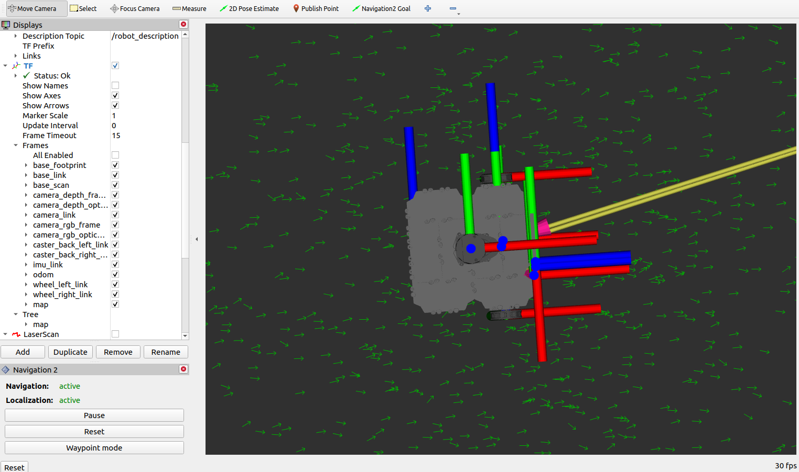
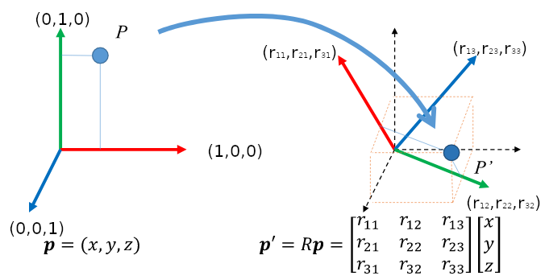
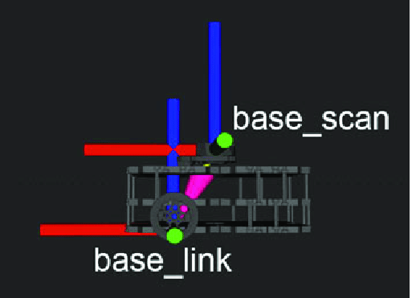
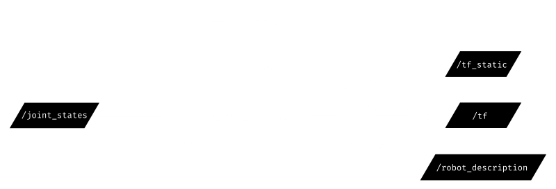

<h1 align="center">Adapting a Custom Robot for Nav2 Project</h1>

Start with `TF transforms` that are required for the navigation to stack. When you launch `rviz` with TurtleBot3, you have seen that we can dispay the `TF transforms` for the robot.



In `TF`, there is different frames, `base_link`, `base_footprint`, `base_scan`, etc..  

In ROS2 we need to keep track of each frame of the robot and the environment relative to all other frame. You could need to know where a robot is relative to another robot or where a laser scan is relative to the map origin or to another part of the robots, etc.

The default solution to find this is to compute a `3D translation` plus `3D rotation` between each existing frame. Using `TF` package allows this process simpler. `TF package` which is named `TF` to the `TF package` will keep track of each 3D coordinate frame over time and it is as true to the tree of all the frames in your robot and in the environemnt.



We need at least three transfoms so the robot can work with `TF2`.

TFs needed for Nav2:
1. `map` -> `odom`

    The first one is the `map` to `odom`. This is going to be published by the localization features.

2. `odom` -> `base_link`
    The second, `odom` to `base_link` 
3. `base_link` -> `base_scan`

    Third, `base_link` to `base_scan`

    

    As you can see, the `base_link` frame will be the frame that is attached to the main structure of the chassis of the robot. This `base_link` frame is usually the first frame that you design for any robot that you create in ROS2. Now the `base_scan` frame is where the LiDAR is situated, so basically where the laser scan is coming from and the transform that we're interested in is the transform between those two frames. Basically, we want to know where the laser scan is relative to the origin of the main structure of the robot. Without this, robot won't know where the obstacles detected with the light. In some cases you might see the frames placed just like this here on the image above. So that the `base_link` frame is at the lowest point of the structure. Some may shows `base_link` located in center of the main frame which is ok. The only important thing is to make sure that the frame for the `base_scan` is placed correctly exactly where the LiDAR is. In `rqt`, you will be able to see that the `tf tree` indicates that is connected `base_link` to `base_scan`. Having this `base_link` to `base_scan` in the tree, the navigation can also compute the transformation between the `map` frame and the `base_scan` to effectively use the data from the LiDAR and the place of the obstacles correctly on the `map`.


Any robot that you create, you will create a `URDF (United Robot Description Format)` file to describe all the elements and frame of your robot. URDF is `XML` format. In URDF, you robot will be described the different frames of the robot, including, base_link and base_scan of the frame. 

**To create TFs, we just need to create a URDF**



Once we have written the URDF, we can start an existing node that you will find in almost all robots. This node is the `robot_state_publisher`. As input, it will receive the URDF and the `joint_states` data published by the controller to say, for example, what is the position of the velocity of the wheels. As an output, the `robot_state_publisher` will then compute and publish the transforms for your robot, and this `TF` is going to be used by the navigation stack.

```bash
$ sudo apt install ros-foxy-urdf-tutorial

# source ros2
$ source /opt/ros/foxy/setup.bash
$ ros2 launch urdf_tutorial display.launch.py model:=$(pwd)/my_robot.urdf
```


# Useful Sources 
[TF2](https://husarion.com/tutorials/ros-tutorials/6-transformation-in-ROS/)
<!-- /etc/apt/sources.list.d/ros2.list -->
<!-- deb [arch=amd64 signed-by=/usr/share/keyrings/ros-archive-keyring.gpg] http://packages.ros.org/ros2/ubuntu focal main -->
