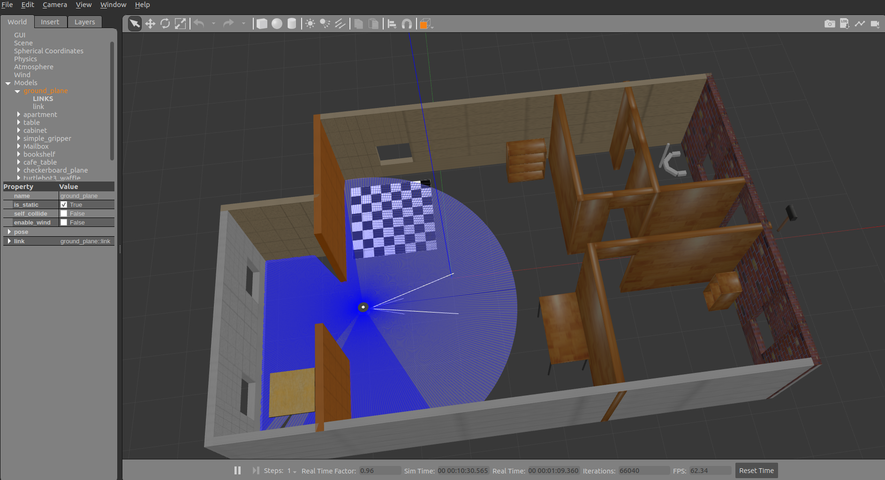
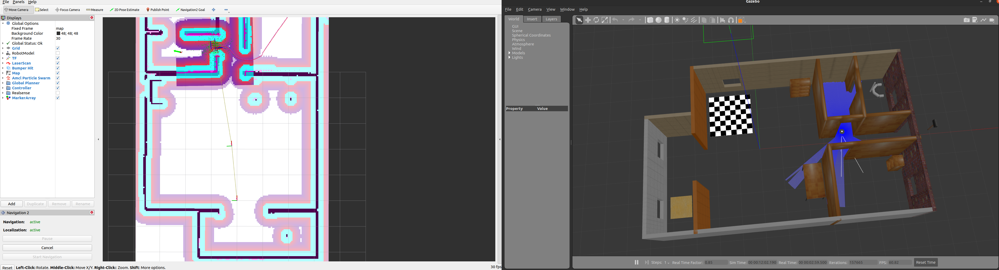

<h1 align="center">ROS2-Nav2 Project</h1>

# Build and Save a World in the Gazebo Building Editor
```bash
$ gazebo
```
`Edit << Building Editor` then begin building. 

Once world is create `File << Save As`. Now you will have **model.config** and **model.sdf** files.

Now start the Gazebo again
```bash
$ gazebo
```
In `Insert` pannel, you can import directly add your world into Gazebo.

## **[Optional] Using Floor Plan** 
If you have a floor plan image (in png), you can import from `Edit << Building Editor` then begin building. And then Scaled it well.

Now, the image with corrected scaled is shown. Use wall to create. For more precise use `shift` key.

## Build world file
```bash
$ gazebo
```
`Insert` pannel << insert the your model. Once it is doen, `File` << `Save World As` and then save as  `.world` format.

To open <name_of world file>.world:
```bash
$ gazebo my_world.world
```

Now we have a complete custom world based on a floor plan. This will simulated world will be used to testing.

# Make TurtleBot3 Navigate In the world
Now make turtlebot3 to navigate in this world. The goal would be to add up the robot so that it can move in the world. Also generate a map and navigate in the map.

[Optional] Here, pay attention this `ros2 launch turtlebot3_gazebo turtlebot3_world.launch.py`. Understand lauch.py structure will be useful.
```bash
$ cd /opt/ros/foxy/share
```
Here in `share` folder have all of the packages. 
```bash
$ cd turtlebot3_gazebo 
$ cd worlds
```
Will indicates where examples of world files are located.

## Make turtlebot3 workspace


Build ROS2 workspace
```bash
$ mkdir -p turtlebot3_ws/src 
$ cd turtlebot3_ws/src
$ git clone https://github.com/ROBOTIS-GIT/turtlebot3_simulations.git .

# check out correct version. For example for foxy
$ git checkout foxy-devel
$ git pull
$ cd ..
$ colcon build --symlink-install
```

### Two ways you can launch you world
Modification on [turtlebot3_my_world](https://github.com/bmaxdk/ROS2-Nav2-with-SLAM-and-Navigation/tree/main/project/src/turtlebot3_gazebo/models/turtlebot3_my_world), [my_world file(turtlebot3_my_world and my_world.world)](https://github.com/bmaxdk/ROS2-Nav2-with-SLAM-and-Navigation/tree/main/project/src/turtlebot3_gazebo/worlds) and [my launch file (turtlebot3_my_world.launch.py and turtlebot3_my_world_using_model.launch.py)](https://github.com/bmaxdk/ROS2-Nav2-with-SLAM-and-Navigation/tree/main/project/src/turtlebot3_gazebo/launch) 


Updates `my_world.world` to add robot model. Remove other physics appeared in .world file:
```world

    <physics type="ode">
      <real_time_update_rate>1000.0</real_time_update_rate>
      <max_step_size>0.001</max_step_size>
      <real_time_factor>1</real_time_factor>
      <ode>
        <solver>
          <type>quick</type>
          <iters>150</iters>
          <precon_iters>0</precon_iters>
          <sor>1.400000</sor>
          <use_dynamic_moi_rescaling>1</use_dynamic_moi_rescaling>
        </solver>
        <constraints>
          <cfm>0.00001</cfm>
          <erp>0.2</erp>
          <contact_max_correcting_vel>2000.000000</contact_max_correcting_vel>
          <contact_surface_layer>0.01000</contact_surface_layer>
        </constraints>
      </ode>
    </physics>
    
    <include>
      <pose>-2.0 -0.5 0.01 0.0 0.0 0.0</pose>
      <uri>model://turtlebot3_waffle</uri>
    </include>
```
To assign robot `burger`, `waffle`, `waffle_pi`, you need to rename this part.
```
    <include>
      <pose>-2.0 -0.5 0.01 0.0 0.0 0.0</pose>
      <uri>model://turtlebot3_waffle</uri>
    </include>
```

**To open your world with turtlebot3**

1. Using `.world`:
```bash
$ source install/setup.bash
$ ros2 launch turtlebot3_gazebo turtlebot3_my_world.launch.py
```

2. Using `.model`:
```bash
$ source install/setup.bash
$ ros2 launch turtlebot3_gazebo turtlebot3_my_world_using_model.launch.py
```
# Make Turtlebot3 Navigate World
Now the robot is fully integrated into the custom world that have created.
* Generate Map using SLAM
* Navigate robot using the map

```bash
# In workspace

# Terminal1
$ source install/setup.bash
$ ros2 launch turtlebot3_gazebo turtlebot3_my_world.launch.py

# Terminal2
$ source install/setup.bash
$ ros2 launch turtlebot3_cartographer cartographer.launch.py use_sim_time:=True

# Terminal3
$ source install/setup.bash
$ ros2 run turtlebot3_teleop teleop_keyboard

#Once map is ready
# Terminal4
$ ros2 run nav2_map_server map_saver_cli -f maps/custom_map
```
Modify `maps/custom_map.pgm` to `custom_map.pgm`
```yaml
image: custom_map.pgm
mode: trinary
resolution: 0.05
origin: [-2.66, -3.56, 0]
negate: 0
occupied_thresh: 0.65
free_thresh: 0.25
```

**Now begin to Navigate the robot with the custom map**




```bash
# In workspace

# Terminal1
$ export TURTLEBOT3_MODEL=waffle
$ source install/setup.bash
$ ros2 launch turtlebot3_gazebo turtlebot3_my_world.launch.py

# Terminal2
$ export TURTLEBOT3_MODEL=waffle
$ source install/setup.bash
$ ros2 launch turtlebot3_navigation2 navigation2.launch.py use_sim_time:=True map:=maps/custom_map.yaml
```

# [Troubleshooting]
If gazebo is not launching, try:
```bash
$ source /usr/share/gazebo/setup.sh
```

In .world if you have duplicated name appeared, it may cause open the gazebo. Make sure change duplicated name.

## Troubleshooting `protocol buffer`
Issue appeared when `protoc version` is not supported to current `turtlebot_gazebo` setup.First need to check **protocol buffer** version:

```bash
$ protoc --version
```

if `protoc` version is higher, try libprotoc 3.6.1:

Download `protobuf-cpp-3.6.1.tar.gz` in [Protocol Buffers v3.6.1](https://github.com/protocolbuffers/protobuf/releases/tag/v3.6.1)

```bash
$ tar -xzf protobuf-cpp-3.6.1.tar.gz
$ cd protobuf-3.6.1
# Install Dependencies for prtobuf
$ sudo apt-get install autoconf automake libtool curl make g++ unzip
$ ./autogen.sh

# Compile and install:
$ ./configure
$ make
$ sudo make install
# Update the Shared Libarary Cache:
$ sudo ldconfig

# Varify protoc version
$protoc --version

```

### Gazebo Installation

**Check current Gazebo Version:**

```bash
$ gazebo --version
```
```text
Gazebo multi-robot simulator, version 11.13.0
Copyright (C) 2012 Open Source Robotics Foundation.
Released under the Apache 2 License.
http://gazebosim.org
```

**Install Gazebo:**

[Install Gazebo from source on Ubuntu](https://classic.gazebosim.org/tutorials?tut=install_from_source&cat=install)

```bash
$ sudo apt-get install gazebo11 libgazebo11-dev

# Locate the Gazebo Config Files.
# Try:
$ sudo find / -name gazebo-config.cmake
$ colcon build --cmake-args -Dgazebo_DIR=/usr/lib/x86_64-linux-gnu/cmake/gazebo/gazebo-config.cmake

# Source Gazebo Setup Script
$ sudo find / -name setup.sh | grep gazebo
$ source /path from above/setup.sh

# If you see multiple Gazebo Script such as:
#/usr/share/gazebo-11/setup.sh
#/usr/share/gazebo/setup.sh
# Try gazebo in /usr/share/

# Install gazebo_ros_pkgs for ROS2 Foxy
$ sudo apt-get install ros-foxy-gazebo-ros-pkgs
$ source /opt/ros/foxy/setup.bash
$ colcon build

```


